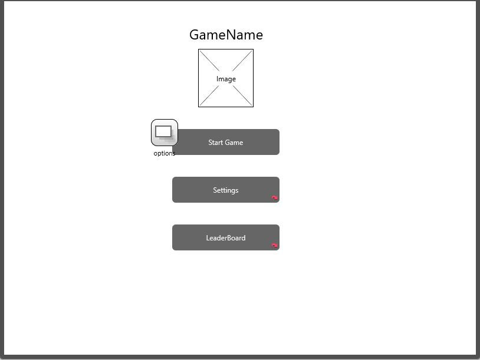

# The Maze Game
#  How to Play?
1. Choose difficulty level:
* 5 by 5 : really easy and mostly one clear path and thus the timer is only 15 seconds.

* 10 by 10 : normal and the timer is 30 seconds.

* 20 by 20 : difficult and takes more time to draw and the timer is 60 seconds.
2. Try to beat the timer (Think Fast!)
3. Try to get your name on the leader board.

# List of technologies used in this project:

<li> HTML
<li> CSS
<li> Java Script
<li> JSON
<li> 
<li> Visual code

# Wireframes:



# User Stories:
<li> As a player, I want to have control over the audio of the game, so that I can disable it if I found it distracting.
<li> As a player, I want to have different sizes of mazes, so that I can choose my most sutible level.
<li> As a player, I want the highest score to be stored, so that I can have a competetion.
<li> As a player, I want different random mazes, so that I can not memorize the correct path.
<li> As a player, I want a game countdown, so that it is more challenging to play. 

# Planning/Development process:

<li> Create new repository.
<li>Create the empty files for each wireframe.
<li> Determine the best algorithm to generate the maze.
<li> Implement the maze generator algorithm and draw the maze on the canvas.
<li> Add the character.
<li> Add keyboard listener to move the character in an allowed path.
<li> Style the pages with uniform design.
<li> Add local storage for necessary variables.
<li> Sort the leader Board variable with each win.
<li>Create the readme file.

# Structure:
1. One Style CSS file for all pages.
2. Two java script files:
* main.js : maze.html
* second.js : (index, results, leaderBoard).js

# Main function:
```
function dfs(cell) {

    cell.seen = true;
    next = getNeighbors(cell.row, cell.col);

    if (next) {
        next.seen = true;
        stack.push(cell);
        clearPath(cell, next);
        dfs(next);

    } else if (stack.length > 0) {
        next = stack.pop();
        dfs(next);
    }
    drawCell();
    if (stack.length == 0) { return }
}
```

The depth first search algorithm allow the users to obtain different and random mazes on each reload. it recursively try to reach all cells by randomly go to one cell(neighbor) at each step while storing those neigbors that were not chosen and if it reached a cell with no new neighbors left, it goes back to the discarded path and repeat which results in a maze.
This method can also be implemented to solve the maze.

# Future Work For The Maze
<li> Improve the design 
<li> Add cam-based control